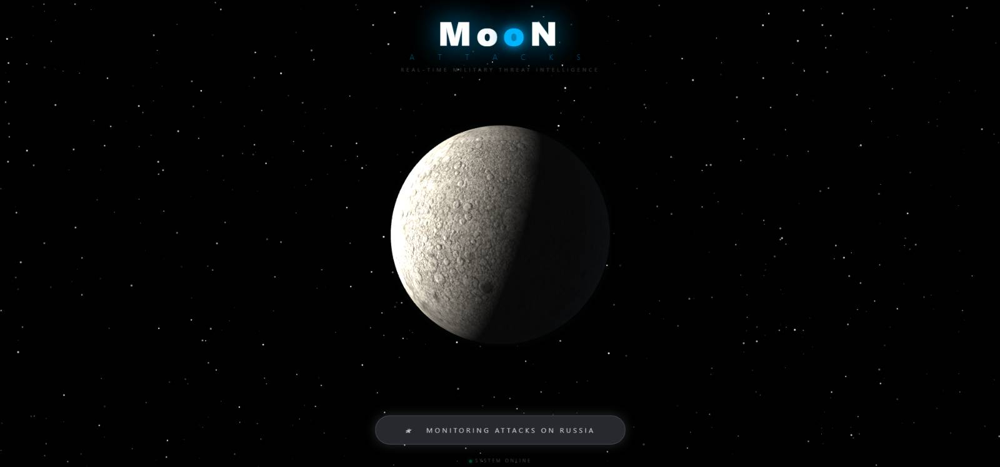
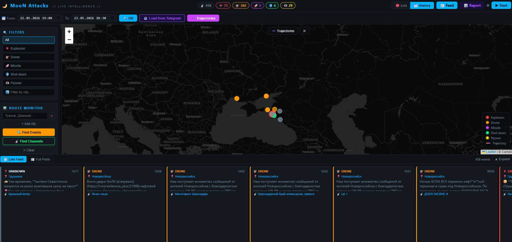

<p align="center">
  
  
  
  
  
</p>

<h1 align="center">🌙 MooN Attacks</h1>
<p align="center"><b>Real-time military threat intelligence platform</b></p>
<p align="center">Monitor Telegram channels · AI-powered analysis · Interactive maps · Intelligence reports</p>

---

## Screenshots

<p align="center">
  
</p>

<p align="center">
  
</p>

---

## What is MooN Attacks?

MooN Attacks is an open-source OSINT platform for monitoring military events in real time via Telegram channels. It automatically collects messages, classifies events (explosions, drones, missiles, etc.), plots them on an interactive map, and generates AI-powered intelligence reports.

> Built for analysts, researchers and journalists covering conflict zones.

---

## Features

| Feature | Description |
|---------|-------------|
| 🗺️ **Live Map** | Real-time event markers on an interactive map (RF territory filter) |
| 📰 **Live Feed** | Chronological feed with filters by event type and city |
| 🤖 **AI Reports** | Claude AI generates full intelligence reports with sources |
| 📡 **Telegram Monitor** | Real-time monitoring of multiple channels simultaneously |
| 📥 **History Load** | Load historical messages from Telegram for any time range |
| 🛣️ **Route Tracking** | Track attack routes across multiple cities |
| 📊 **Export** | Export to Word / HTML / PDF / JSON / CSV |
| 🌙 **Splash Screen** | Animated 3D Moon with Three.js |

---

## Quick Start

### 1. Clone the repository

```bash
# Via GitHub CLI
gh repo clone SiLiN-ua/MooN-Attacks

# Via Git
git clone https://github.com/SiLiN-ua/MooN-Attacks
```

### 2. Install dependencies

```bash
pip install -r requirements.txt
```

### 3. Configure API keys

```bash
cp .env.example .env
```

Edit `.env` and fill in your credentials:

```env
TELEGRAM_API_ID=your_api_id
TELEGRAM_API_HASH=your_api_hash
TELEGRAM_PHONE=+380XXXXXXXXX
ANTHROPIC_API_KEY=your_anthropic_api_key
```

> **Get Telegram API keys:** https://my.telegram.org/apps  
> **Get Anthropic API key:** https://console.anthropic.com

### 4. Authenticate Telegram (first time only)

```bash
python auth_telegram.py
```

### 5. Run

```bash
python app.py
```

Open in browser: **http://localhost:5001**

---

## Project Structure

```
MooN-Attacks/
├── app.py                  # Flask server, API routes, SocketIO
├── auth_telegram.py        # Telegram first-time authentication
├── export_channels.py      # Utility: export channel list
├── seed_channels.py        # Utility: pre-load channel list to DB
├── test_env.py             # Utility: verify environment variables
├── requirements.txt        # Python dependencies
├── .env.example            # Environment template
├── core/
│   ├── db.py               # Database models (Peewee + SQLite)
│   ├── filter.py           # Military keyword classifier (explosions, drones, missiles…)
│   ├── geo_parser.py       # City & coordinate extraction from message text
│   ├── reporter.py         # AI report generation (Claude Opus + web search)
│   ├── telegram_monitor.py # Telegram client (Telethon MTProto)
│   └── trajectory.py       # Attack route analysis
├── templates/
│   ├── splash.html         # Landing page (3D Moon — Three.js)
│   ├── index.html          # Main map page (Leaflet.js)
│   ├── feed.html           # Live event feed
│   ├── report.html         # AI intelligence report viewer
│   └── channel.html        # Single channel posts view
└── static/
    ├── js/main.js          # Map logic, export functions
    └── css/                # Styles
```

---

## How It Works

```
Telegram Channels
      ↓
  Telethon (MTProto) — real-time monitoring or history load
      ↓
  filter.py — keyword classifier (event type)
  geo_parser.py — extracts city & coordinates
      ↓
  SQLite Database (Peewee ORM)
      ↓
     ┌─────────────────────┐
     ↓                     ↓
Leaflet Map           Live Feed
(RF territory)        (all events)
     ↓
  Claude AI → Intelligence Report
  (web search + source links + analysis)
```

---

## Pages

| URL | Description |
|-----|-------------|
| `/` | Splash screen with animated Moon |
| `/map` | Live interactive map |
| `/feed` | Live event feed |
| `/report` | AI intelligence report generator |
| `/channel/<name>` | Posts from a specific channel |

---

## Requirements

- Python 3.10+
- Telegram account (for MTProto access)
- Anthropic API key (Claude) — for AI reports
- Internet connection for map tiles (CartoDB)

---

## License

MIT License — free to use, modify and distribute.

---

<p align="center">
  Made by <a href="https://github.com/SiLiN-ua">Yehor Selin (SiLiN)</a> •
  <a href="https://www.linkedin.com/in/yehor-selin/">LinkedIn</a>
</p>
